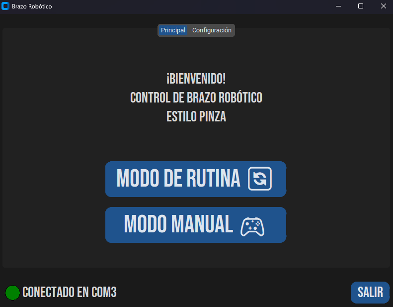
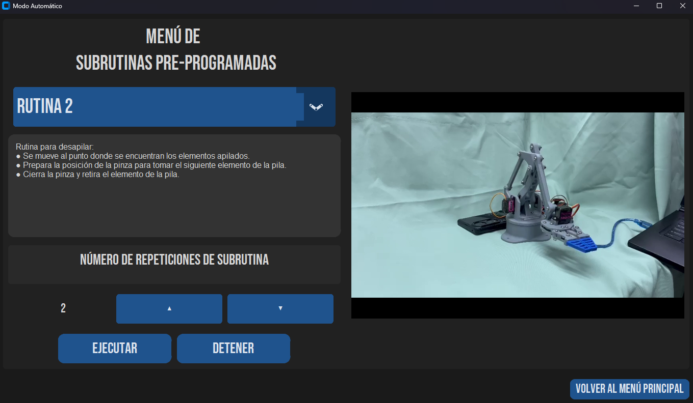
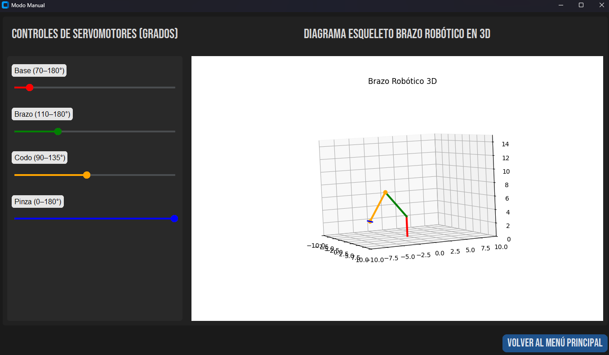

# Control de Brazo Robótico — Interfaz en Python

Aplicación en Python diseñada para controlar un brazo robótico tipo pinza, ofreciendo dos modos de operación: **Manual y Automático**.
Incluye control por GUI, detección automática de Arduino, ejecución de rutinas, visualización de videos y sistema de conexión en tiempo real.

## Características principales

1. Modo de Rutina
    * Ejecución de rutinas predefinidas del Arduino.
    * Envío de parámetros como repeticiones.
    * Reproducción automática de videos demostrativos.
2. Modo Manual
    * Control directo de cada articulación o servomotor.
    * Visualización en 3D del movimiento utilizando gráfico tipo "esqueleto".
    * Sliders intuitivos y comandos inmediatos.
3. Interfaz moderna
    * Construida utilizando CustomTkinter.
    * Soporte para tema claro / oscuro.
    * Textos estilizados con fuente *Bebas Neue*.
4. Detección de Arduino
    * Reconocimiento automático del puerto COM.
    * Reconexión automática si se desconecta físicamente.
    * LED indicador de estado: conectado / desconectado.
5. Visualización de videos
    * Cada rutina predefinida incluye un video demostrativo.
    * Integrado directamente en la GUI.

## Requisitos

### Software

* Python 3.10 o superior
* pip

### Dependencias (requirements.txt)

Se pueden instalar todas con:

```bash
pip install -r requirements.txt
```

Entre las librerías principales están:

* customtkinter
* pyserial
* matplotlib
* numpy
* pillow
* opencv-python

### Requisito adicional

Antes de iniciar la aplicación, instalar la fuente Bebas Neue.\
Ubicada en fonts/BebasNeue-Regular.ttf

#### En Windows

Click derecho → Instalar.

> Esto asegura que los textos y widgets de la interfaz se visualicen correctamente.

## Ejecución de la aplicación

### Opción 1 — Desde Python

```bash
python main.py
```

### Opción 2 — Crear ejecutable con PyInstaller

```bash
pyinstaller --clean --onefile --noconsole main.py
```

> Dicho ejecutable aparecerá en:
/dist/main.exe

## Autores

* Hermes Rojas Sancho - C16882
* Donifer Campos Parra
* Jose Ignacio Goldoni

### Curso

CI-0118 — Lenguaje Ensamblador\
Proyecto Integrador de Lenguaje Ensamblador y Fundamentos de Arquitectura

### Año

2025

### Universidad de Costa Rica

## Capturas de pantalla

### Vista principal



### Modo de Rutina



### Modo Manual



### Indicador de conexión


